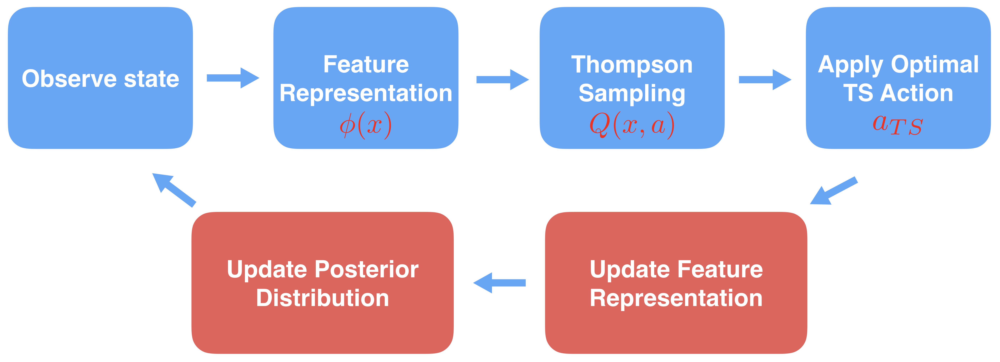
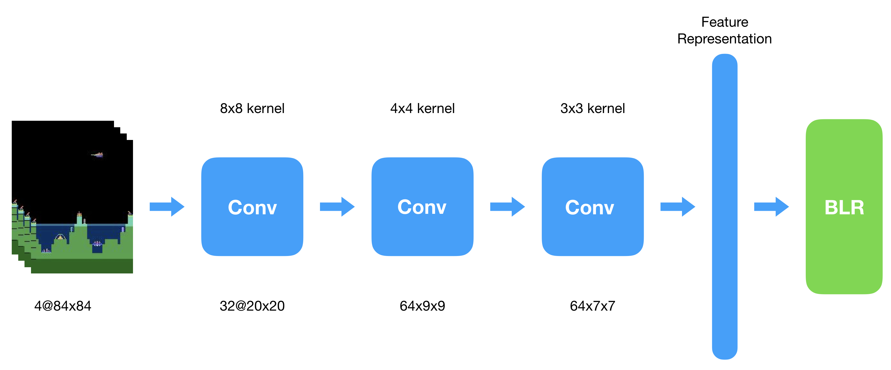
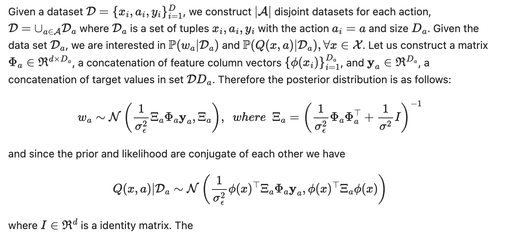

# BDQN-PyTorch

Implementation of [Efficient Exploration through Bayesian Deep-Q Networks](https://arxiv.org/pdf/1802.04412.pdf).

Original Implementation can be found [here](https://github.com/kazizzad/BDQN-MxNet-Gluon).

**A Thompson Sampling of deep explorative RL**

Bayesian deep Q networks (BDQNs) is an RL method which applies the function approximation capabilities of deep neural networks to problems in reinforcement learning. The model follows the work described in the paper Efficient Exploration through Bayesian Deep Q-Networks, written by Kamyar Azizzadenesheli, Emma Brunskil and, Anima Anankumar.

**Summary of the algorithm**:

The BDQN, in the sense of implementation, is same as DDQN, [Deep Reinforcement Learning with Double Q-learning](https://arxiv.org/abs/1509.06461), written by Hado van Hasselt, except in the last layer, where instead of using linear regression as in DDQN, BDQN uses Bayesian Linear Regression (BLR) and for exploration, instead of using naive &#949;-greedy strategy as in DDQN, BDQN uses Thompson sampling and avoid any naive exploration.

As it is mentioned before, BDQN has the same architecture as DDQN has except, in BDQN we remove the last layer of DDQN. We call the output of the network as a representation &#966;(&#183;), and instead assign BLR layer on the top of the representation. The input to the network is state of the environment, `x` and the output is &#966;(&#183;), the feature representation. The input to BLR block is the feature representation.
 
<figure>
  
</figure>

 **BDQN Architecture**
 
The input to the network part of BDQN is 4 × 84 × 84 tensor with a rescaled, mean-scale version of the last four observations. The first convolution layer has 32 filters of size 8 with a stride of 4. The second convolution layer has 64 filters of size 4 with stride 2. The last convolution layer has 64 filters of size 3 followed by a fully connected layers with size 512. We add a BLR layer on top of this.

<figure>
  
</figure>

**BLR, a closed form way of computing posterior**

In both DDQN (linear regression) and BDQN (Bayesian linear regression) the common assumptions are as follows:
* The layer before the last layer provides features &#966;(&#183;), suitable for linear models.
* The generative model for state-action value, Q(x,a) is drawn from the following generative model:
      *y ~ wa&#966;(&#183;) + &#949;* where *y* is a sample of Q(x,a) and for simplicity we assume *&#949;* is a mean-zero Gaussian noise with variance &#963;n2.

The question in linear regression problem is given a bunch of (x,a,y), what *wa* can be in term of minimizing least square error and the task is to find a *wa* which matches *x,a* to *y*. In Bayesian machinery, we assume *wa* is drawn from a prior distribution, e.g. mean-zero Gaussian distribution with variance&#963;2. Given data, the question in BLR is what is the posterior distribution of *wa* which matches *x,a* to *y*. The interesting property of BLR is that given data, the distribution of *wa*, therefore Q(a,x), can be computed in closed form and due to the conjugacy, the distribution over of samples of Q(a,x) has closed form.

Given this nice property, at each time step, we can compute the posterior distribution of Q-function. As Thompson Sampling based strategies suggest, we draw a Q-function out of the posterior distribution and act optimally with respect to that for that time step.

**Target Network**

In both DDQN and BDQN we assume &#966;*&#952;*(&#183;) is paramterized by parameters *&#952;*. Furthermore, the obervation *y* for time step *t* is after seeing the cosequative seqeucen of *xt, at, rt, xt+1*

> *yt := rt + &#955; Qtarget(xt+1,argmaxa'Q(xt+1,a'))*

where Qtarget has same structure of Q, but with paramteters *&#952;target and *watarget, for all actions where the target parameters get updated ones in a while.

**Posterior update**

<figure>
  
</figure>
